# Nigggli Font Project
    
Nigggli is a swiss style sans serif typeface 

## Design Features

The complete family contains 2 axis withn five weights and three width steps.

## License
Nigggli is available under the <a href="https://scripts.sil.org/OFL" target="_blank" rel="noopener noreferrer">Open Font License (OFL)</a>, allowing designers, developers, and organizations to freely use, modify, and share the typeface while preserving its integrity and attribution.

## The members of the Nigggli family

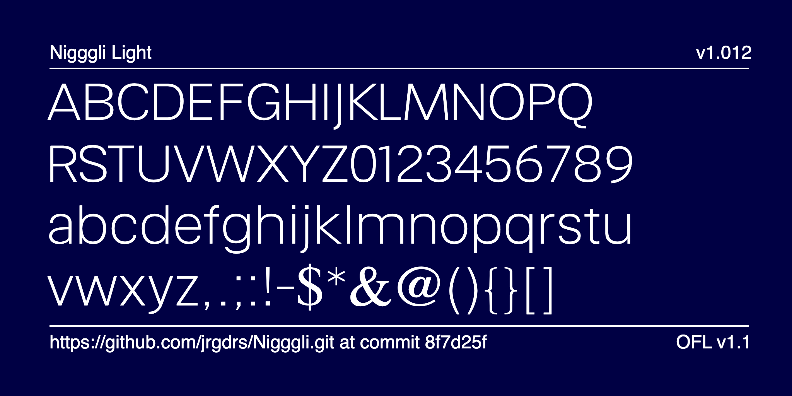
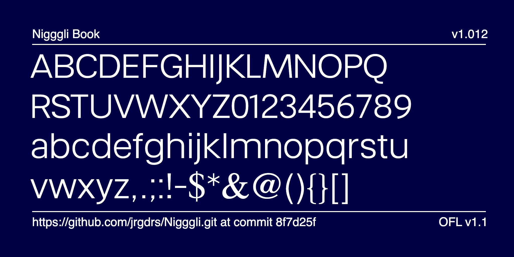
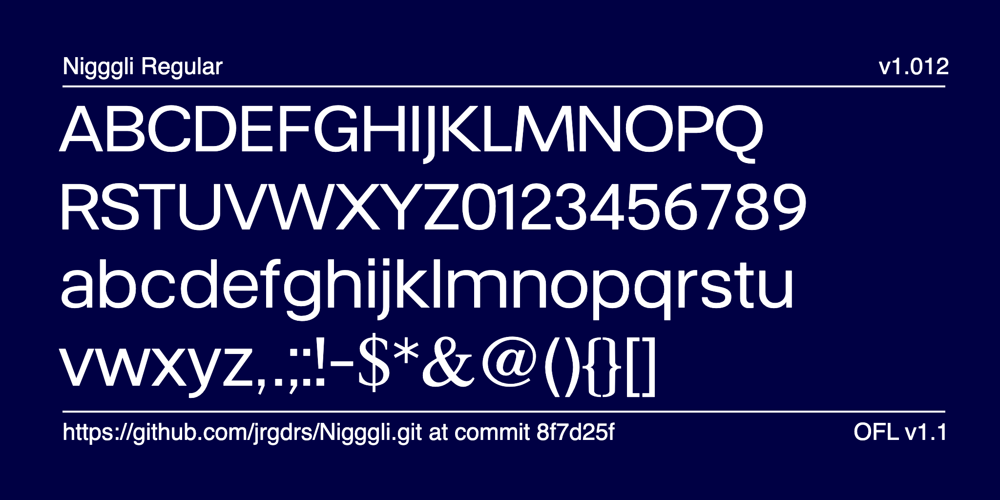
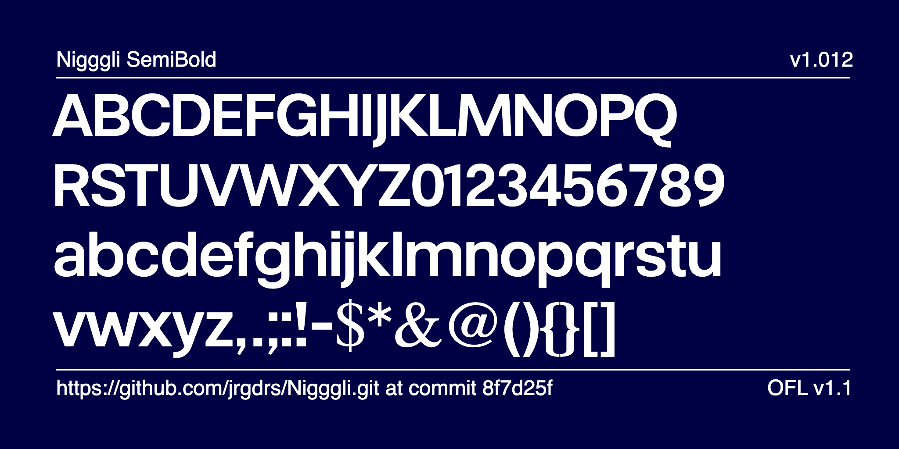
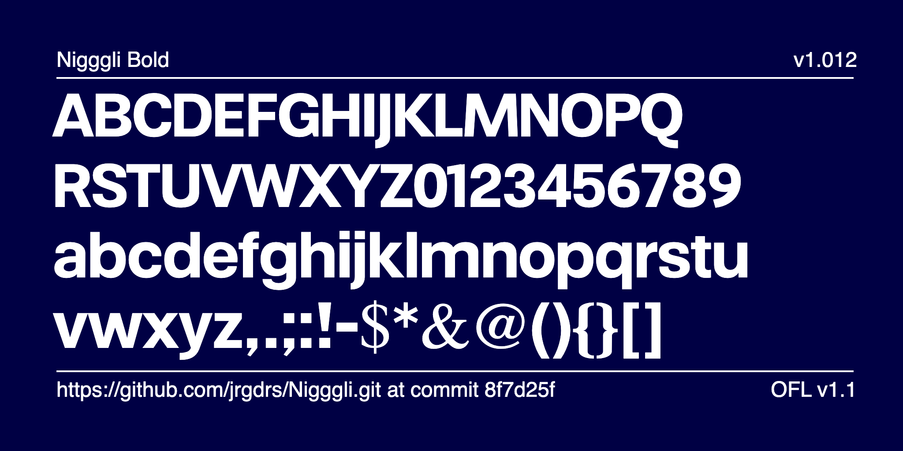
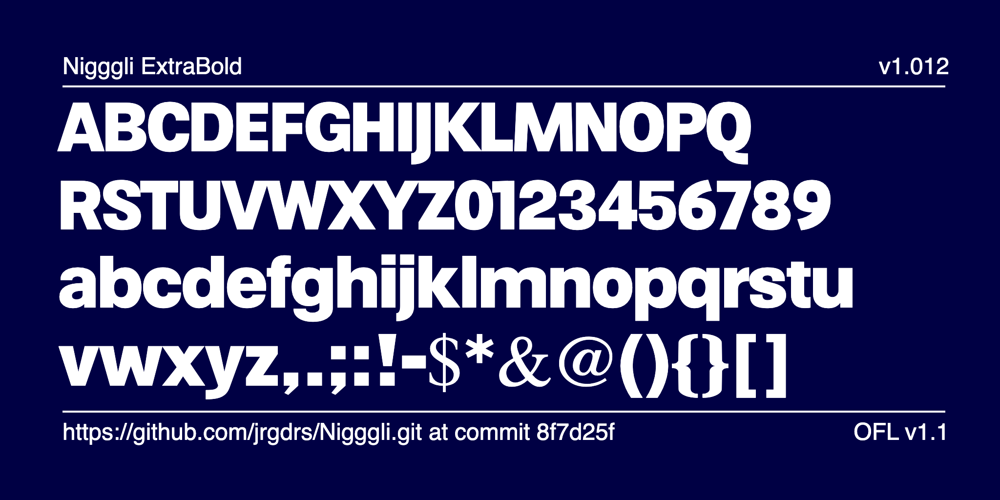

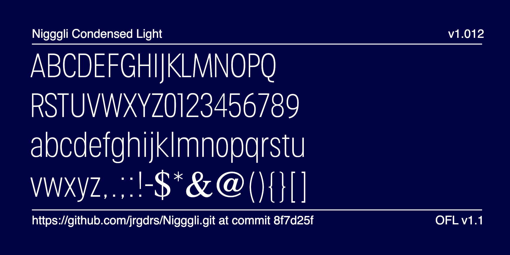
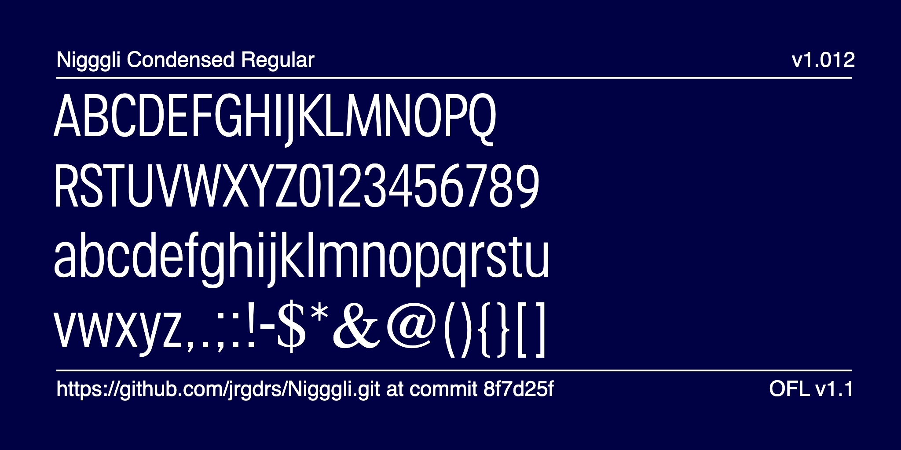
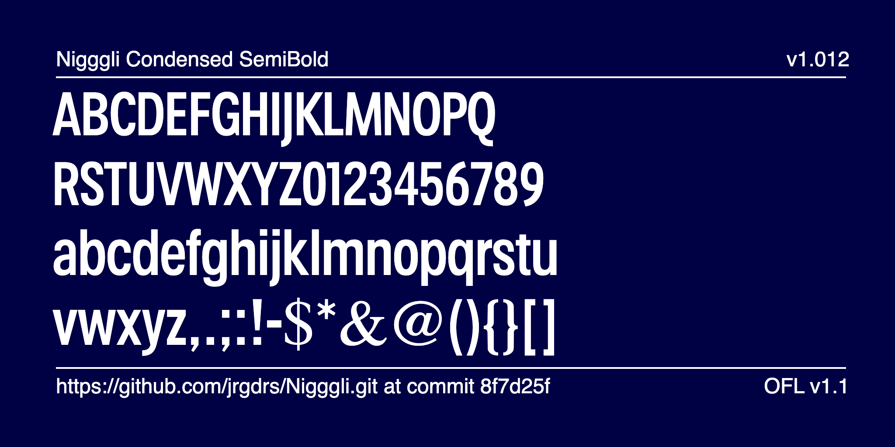
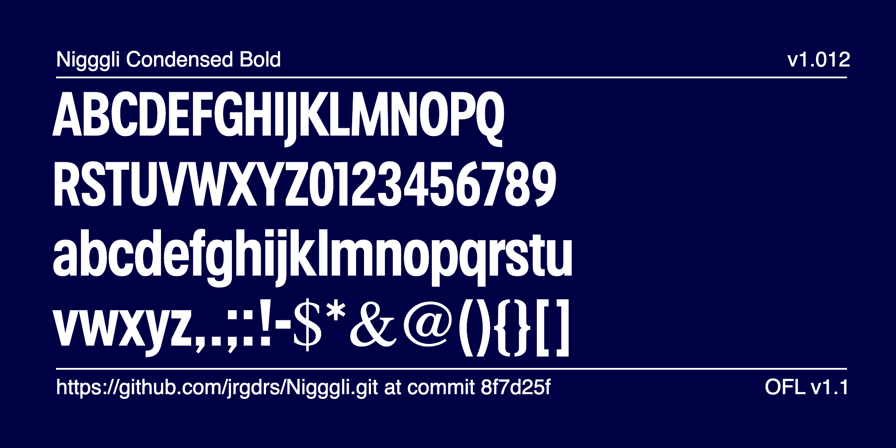

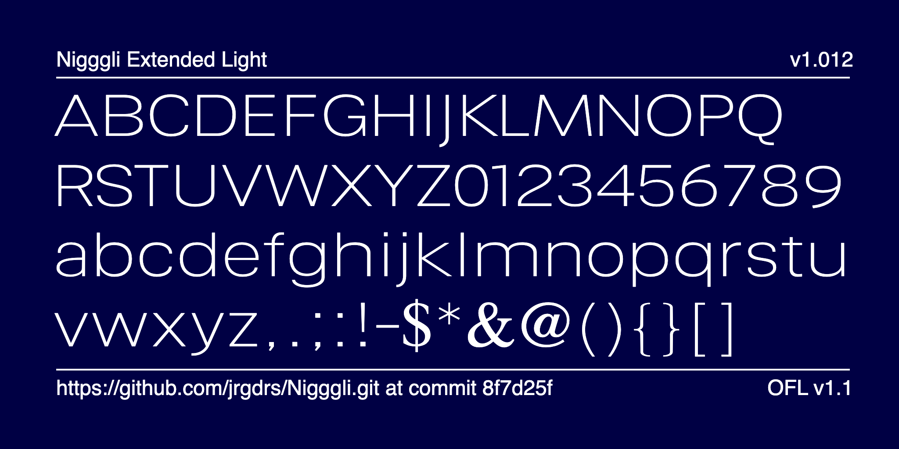
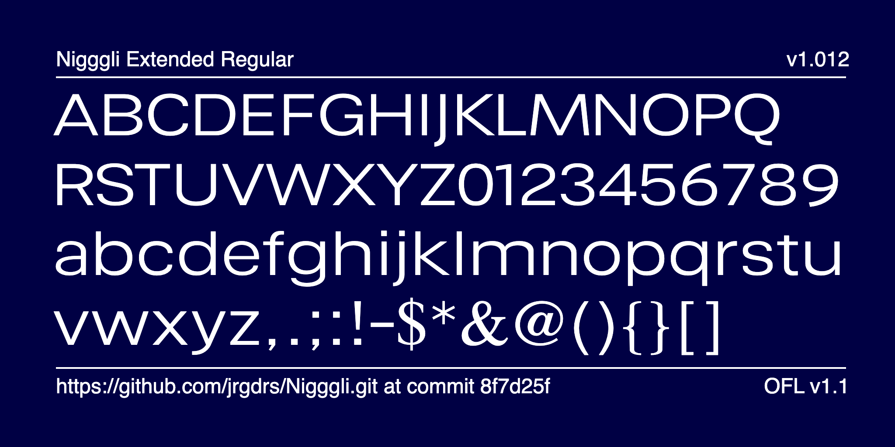
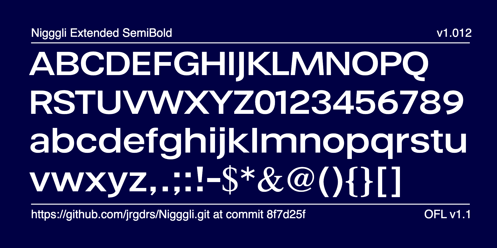
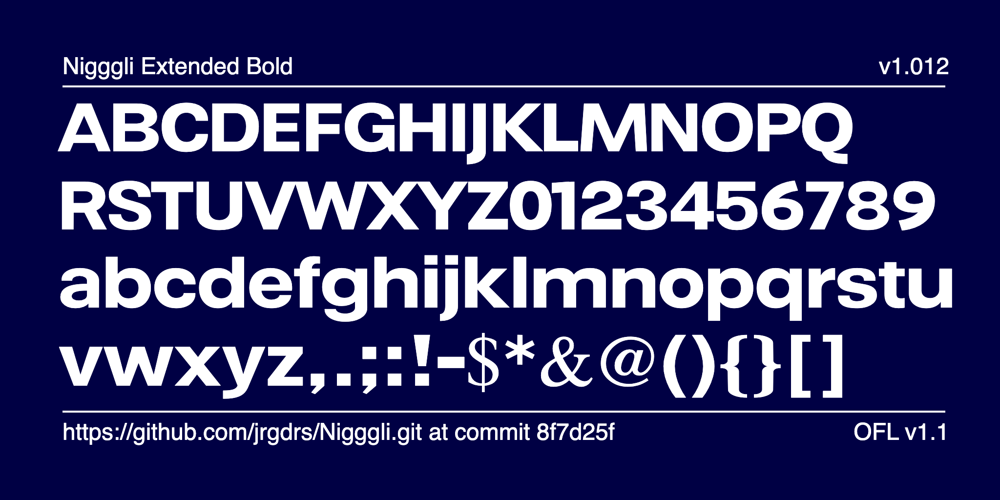
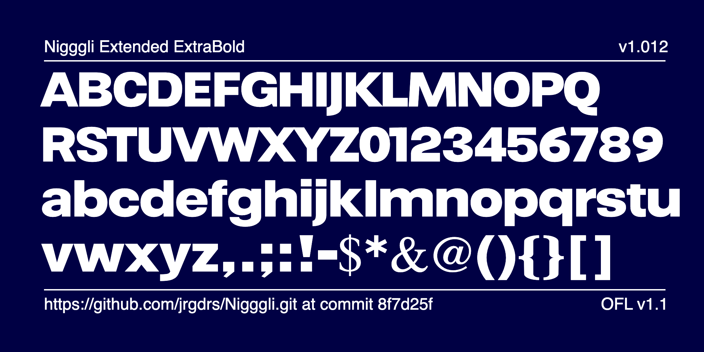

## Specimen Books

- [Font Specimen](documentation/specimens/SpecimenNL.pdf)

- [Brentano (German)](documentation/specimens/Brentano.pdf)
- [Picon (Spanish)](documentation/specimens/Picon.pdf)

## Online Preview and Download 

[Test the typeface online](https://jrgdrs.github.io/Nigggli/)

## Issue Support

[Ticket system](https://github.com/jrgdrs/Nigggli/issues)

 
 